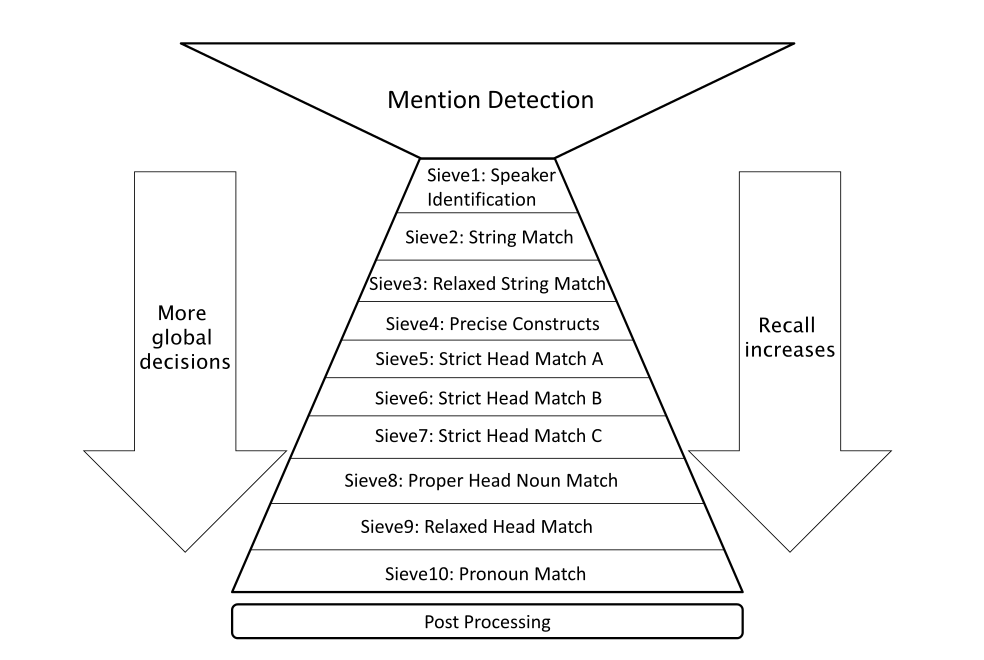

# Implementation der Stanford-Sieb-Architektur im BART-Koreferenz-Resolutionssystem

## Projektbeschreibung

BART, das _Beautiful Anaphora Resolution Toolkit_, wurde beim Projekt _Exploiting Lexical
and Encyclopedic Resources For Entity Disambiguation_ am Johns Hopkins Summer Workshop 2007
erstellt. BART unternimmt automatische Koreferenzresolution mithilfe einer modularen Pipeline,
die aus einer Vorverarbeitungsphase (Daten von MMAX2-Annotationsebenen werden aggregiert),
der Extraktion der NP-Kandidaten, der Extraktion der NP-Merkmale und der Kandidatenpaare
sowie aus einem Resolutionsmodell besteht. BART üblicherweise einen auf einem Ansatz
von Soon et al. (2001) basierenden Resolutionsalgorithmus, der Kandidaten-NPs hinsichtlich ihrer Merkmale
paarweise vergleicht. Statt diesem implementierten wir das Resolutionssystem der
Stanford-NLP-Gruppe um Lee et al. (2013), das sich durch seine Sieb-Architektur
auszeichnet. Obwohl auf Regeln basiert, konnte es dennoch das beste Ergebnis
beim CoNLL-2011 _shared task_ erzielen. 



Im Rahmen der Sieb-Architektur werden nacheinander --
absteigend nach ihrer Präzision geordnet -- eine Reihe von deterministischen Koreferenzmodellen
angewendet, wobei jedes Modell auf den Output seines Vorgängers aufbaut. Besonders das
Entität-zentrische Modell, bei dem Merkmale über alle Vorkommen einer Entität geteilt
werden, bietet einen deutlichen Wissensgewinn, der von Nutzen für BARTs Performanz ist.
Wir verglichen unser System mit BARTs _machine learning_-Konfiguration für das Deutsche
sowie mit dem Standford-System für das Englische.


### Deutsch

|              | Recall | Precision | F_1   |
| ------------ | ------ | --------- | ----- |
| Unser System | 0.644  | 0.691     | 0.667 |
| BART         | 0.721  | 0.532     | 0.612 |

Als Testkorpus verwendeten wir die ersten 99 Dokumente der TüBa-D/Z _treebank_,
wobei wir BARTs ML-Komponente auf den restlichen Dokumenten (Nr. 100 - Nr. 3528) trainierten.

### Englisch

|              | Recall | Precision | F_1   |
| ------------ | ------ | --------- | ----- |
| Unser System | 0.x    | 0.x       | 0.x   |
| Stanford     |        |           |       |

Für die Evaluation unseres Systems auf englischsprachigen Daten verwendeten wir das Trainings-Set der
CoNLL-2012 Shared Task, das auf dem OntoNotes 5.0-Korpus basiert. Die Daten wurde mithilfe mehrerer
Skripte von Olga Uryupina in das MMAX2-Format konvertiert und außerdem von der BART-eigenen
Preprocessing-Pipeline vorverarbeitet. 

Da wir unser System vorrangig für das Deutsche entwickelten, sind diese Ergebnisse deutlich ausbaufähig. 

Der PronounMatchSieve konnte zudem nicht verwendet werden, da es -- anders als der PronounMatchSieve
des Stanford-Systems -- auf grammatischen Funktionen basiert. Eine Ebene, die diese darstellt,
war allerdings nicht verfügbar.  

## Inbetriebnahme

Dieses [GitHub repository](https://github.com/sebastianruder/BART) muss zunächst geklont werden.

Es sollte Eclipse mit den Plugins [EGit](http://www.eclipse.org/egit/) (zur Versionskontrolle)
und [IvyDE](http://ant.apache.org/ivy/ivyde/) (zum _dependency management_)
verwendet werden. Die Dependenzen gehen aus [ivy.xml](ivy.xml) hervor, während die Einstellungen
in [ivysettings.xml](ivysettings.xml) gespeichert sind.

In [config.properties](config/config.properties) muss für den Parameter ```testdata```
das Verzeichnis angegeben werden, indem sich der zu verwendende MMAX2-Datensatz auf dem eigenen
System befindet, bspw. auf einem Windows-System:
```
testData=D:/BART/BART/tuebadz-MMAX2/mmax-100d
```
Auf einem Linux-System:

```
testData=/home/username/BART/BART/tuebadz-MMAX2/mmax-100d
```

Um unser System zu verwenden, muss die main-Methode des [SieveAnnotator](src/elkfed/main/SieveAnnotator.java)
gestartet werden.

Um unser System für das Englische auf den CoNLL-Daten zu verwenden, bspw. auf dem Trainings-Set, müssen in [config.properties](config/config.properties) folgende Parameter verändert werden:

Auf einem Windows-System:
```
testData=D:/BART/BART/tuebadz-MMAX2/mmax-conll/train
```
Auf einem Linux-System:
```
testData=/home/username/BART/BART/tuebadz-MMAX2/mmax-conll/train
```

In beiden Fällen: 

``` language = eng ```

Danach kann wie gehabt die main-Methode des [SieveAnnotator](src/elkfed/main/SieveAnnotator.java)
gestartet werden.


Um BARTs _machine learning_-Konfiguration in Betrieb zu nehmen, muss die main-Methode des [XMLExperiment](src/elkfed/main/XMLExperiment.java)
mit dem Dateipfad der Konfigurationsdatei [idc0_german_closed.xml](config/idc0_german_closed.xml) als Programm-Argument
gestartet werden.
Abhängig von der Größe des Trainingskorpus muss die Minimal- und Maximalgröße des Java _heap space_ als
VM-Argument übergeben werden, z.B. ```-Xms256M -Xmx7168M```. Abhängig vom Betriebssystem und von der Größe
des _heap space_ ist hierfür Java x64 vonnöten.

## Repository Struktur

Relevante Dateien im _repository_:

* [src/elkfed/coref](https://github.com/sebastianruder/BART/tree/master/BART/src/elkfed/coref):
Hier befinden sich das [CorefResolver-Interface](src/elkfed/coref/CorefResolver.java) und die
[PairInstance-Klasse](src/elkfed/coref/PairInstance.java)
* [src/elkfed/coref/algorithms/sieve](https://github.com/sebastianruder/BART/tree/master/BART/src/elkfed/coref/algorithms/sieve):
Hier befinden sich eine [Factory-Klasse](src/elkfed/coref/algorithms/sieve/SieveFactory.java), eine
[die abstrakte Sieve-Klasse](src/elkfed/coref/algorithms/sieve/Sieve.java) sowie
[alle Sieve-Subklassen](http://htmlpreview.github.io/?https://github.com/sebastianruder/BART/blob/master/BART/doc/allclasses-frame.html); eine
hierarchische Übersicht findet sich [hier](http://htmlpreview.github.io/?https://github.com/sebastianruder/BART/blob/master/BART/doc/overview-tree.html);
eine genaue Übersicht über alle Klassen und Methoden findet sich [hier](http://htmlpreview.github.io/?https://github.com/sebastianruder/BART/blob/master/BART/doc/index.html)
  1. [SpeakerIdentificationSieve](src/elkfed/coref/algorithms/sieve/SpeakerIdentificationSieve.java)
  2. [StringMatchSieve](src/elkfed/coref/algorithms/sieve/StringMatchSieve.java)
  3. [RelaxedStringMatchSieve](src/elkfed/coref/algorithms/sieve/RelaxedStringMatchSieve.java)
  4. [PreciseConstructSieve](src/elkfed/coref/algorithms/sieve/PreciseConstructSieve.java)
  5. [StrictHeadMatchASieve](src/elkfed/coref/algorithms/sieve/StrictHeadMatchASieve.java)
  6. [StrictHeadMatchBSieve](src/elkfed/coref/algorithms/sieve/StrictHeadMatchBSieve.java)
  7. [StrictHeadMatchCSieve](src/elkfed/coref/algorithms/sieve/StrictHeadMatchCSieve.java)
  8. [ProperHeadNounMatchSieve](src/elkfed/coref/algorithms/sieve/ProperHeadNounMatchSieve.java)
  9. [RelaxedHeadMatchSieve](src/elkfed/coref/algorithms/sieve/RelaxedHeadMatchSieve.java)
  10. [PronounMatchSieve](src/elkfed/coref/algorithms/sieve/PronounMatchSieve.java)
* [src/elkfed/coref/algorithms/soon](https://github.com/sebastianruder/BART/tree/master/BART/src/elkfed/coref/algorithms/soon):
Hier befinden sich die verschiedenen Soon-Algorithmen von BART
* [src/elkfed/coref/discourse_entities](https://github.com/sebastianruder/BART/tree/master/BART/src/elkfed/coref/discourse_entities):
Hier befinden sich die [neue](src/elkfed/coref/discourse_entities/DiscourseEntity.java) sowie die [alte](src/elkfed/coref/discourse_entities/DiscourseEntity.java)
Implementation der DiscourseEntity
* [src/elkfed/coref/eval](https://github.com/sebastianruder/BART/tree/master/BART/src/elkfed/coref/eval):
Hier befindet sich der [MUCScorer](src/elkfed/coref/eval/MUCScorer.java), der zur Evaluation verwendet wird
* [src/elkfed/coref/features/pairs](https://github.com/sebastianruder/BART/tree/master/BART/src/elkfed/coref/features/pairs):
Hier befinden sich die folgenden Feature-Extraktoren, die wir verwendeten:
  1. [FE_AppositiveParse](src/elkfed/coref/features/pairs/FE_AppositiveParse.java)
  2. [FE_Copula](src/elkfed/coref/features/pairs/FE_Copula.java)
  3. [FE_SentenceDistance](src/elkfed/coref/features/pairs/FE_SentenceDistance.java)
  4. [FE_Speech](src/elkfed/coref/features/pairs/FE_Speech.java)
* [src/elkfed/coref/features/pairs/de](https://github.com/sebastianruder/BART/tree/master/BART/src/elkfed/coref/features/pairs/de):
Hier befindet sich der deutsch-spezifische Feature-Extraktor [FE_Syntax_Binding](src/elkfed/coref/features/pairs/de/FE_Syntax_Binding.java)
* [src/elkfed/coref/mentions](https://github.com/sebastianruder/BART/tree/master/BART/src/elkfed/coref/features/mentions):
Hier befindet sich die [Mention-Klasse](src/elkfed/coref/mentions/Mention.java) sowie die [MentionFactory](src/elkfed/coref/mentions/AbstractMentionFactory.java)
* [src/elkfed/coref/processors](https://github.com/sebastianruder/BART/tree/master/BART/src/elkfed/coref/features/processors):
Hier befindet sich der [AnnotationProcessor](src/elkfed/coref/processors/AnnotationProcessor.java)
* [src/elkfed/knowledge](https://github.com/sebastianruder/BART/tree/master/BART/src/elkfed/knowledge):
Hier befindet sich die [SemanticClass](src/elkfed/knowledge/SemanticClass.java)
* [src/elkfed/lang](https://github.com/sebastianruder/BART/tree/master/BART/src/elkfed/lang):
Hier befinden sich die verschiedenen LanguagePlugins und LinguisticConstants
* [src/elkfed/main](https://github.com/sebastianruder/BART/tree/master/BART/src/elkfed/main):
Hier befindet sich das Hauptprogramm unseres Systems, [SieveAnnotator](src/elkfed/main/SieveAnnotator.java),
sowie das Hauptprogramm der BART-ML-Konfiguration, [XMLExperiment](src/elkfed/main/XMLExperiment.java)
* [src/elkfed/nlp/util](https://github.com/sebastianruder/BART/tree/master/BART/src/elkfed/nlp/util):
Hier befinden sich die [Gender-](src/elkfed/nlp/util/Gender.java) und die [Number-Klasse](src/elkfed/nlp/util/Number.java)
* [config](https://github.com/sebastianruder/BART/tree/master/BART/config):
Hier befinden sich [config.properties](config/config.properties), in der die Dateipfade für Test- und Trainingskorpora
angegeben werden, sowie [idc0_german_closed.xml](config/idc0_german_closed.xml), in der die Feature-Extraktoren
für BARTs [XMLExperiment](src/elkfed/main/XMLExperiment.java) festgelegt werden
* [doc](https://github.com/sebastianruder/BART/tree/master/BART/doc):
Hier befinden sich die automatisch generierten Javadoc-Dateien
* [documents](https://github.com/sebastianruder/BART/tree/master/BART/documents):
Hier befinden sich unsere Präsentationsfolien und Berichte
* [names](https://github.com/sebastianruder/BART/tree/master/BART/names):
Hier befinden sich sprachspezifische Listen
* [tuebadz-MMAX2](https://github.com/sebastianruder/BART/tree/master/BART/tuebadz-MMAX2):
Hier befinden sich unsere Korpora sowie [ein Skript](tuebadz-MMAX2/xml2txt.py) zur Konversion in _plain text_
